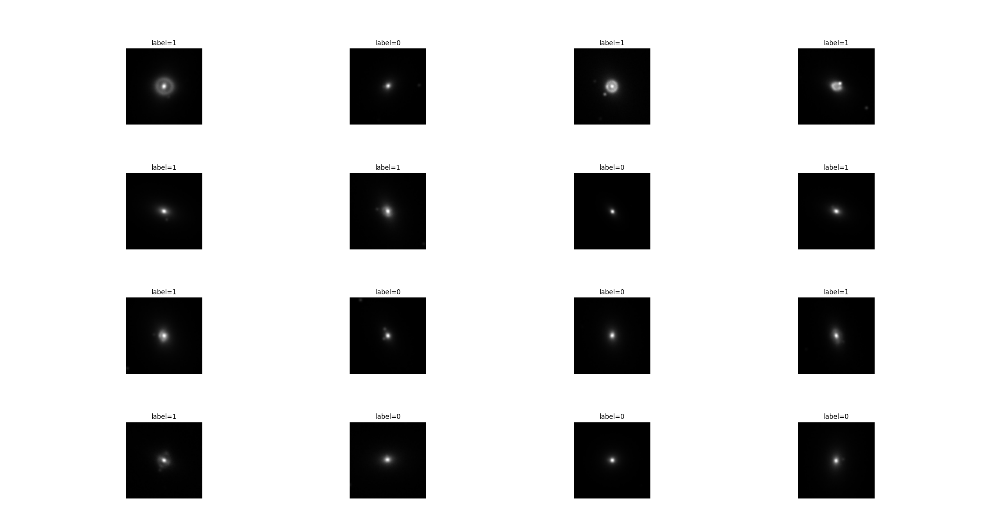

# Quantum Classification for Strong Gravitational Lensing

Quantum Classification for Strong Gravitation Lensing est un projet d'apprentissage machine quantique pour détecter la présence de lentilles gravitationnelles dans une collection d'images simulées.

## Ce que contient ce répertoire

Le projet contient les éléments suivants :

- `src/`: Contient le code source pour le projet.
- `notebooks/`: Contient des notebooks Jupyter pour l'exploration des librairies et la visualisation des données.
- `data/`: Contient les données simulées pour l'entraînement et le test du modèle.
- `docs/`: Contient de la documentation supplémentaire pour l'usage du projet.
- `assets/`: Contient des images et des ressources supplémentaires pour le projet.

## Jeu de données

Le jeu de données utilisé dans ce projet est généré à l'aide de la librairie [`deeplenstronomy`](https://github.com/deepskies/deeplenstronomy). Pour générer le jeu de données, suivre les instructions dans le notebook `notebooks/view_deeplenstronomy.ipynb`. Le jeu de données est ensuite stocké dans le répertoire `data/`.

Pour plus d'informations sur la génération du jeu de données, veuillez consulter le fichier `docs/deeplenstronomy_binary_dataset.md`.

## Contribuer à ce projet

Référez-vous à [dev_tools.md](dev_tools.md) pour les instructions de configuration de l'environnement de développement et les étapes de contribution.

## Ressources supplémentaires

### Bibliothèques utilisées

- [`deeplenstronomy`](https://github.com/deepskies/deeplenstronomy)
